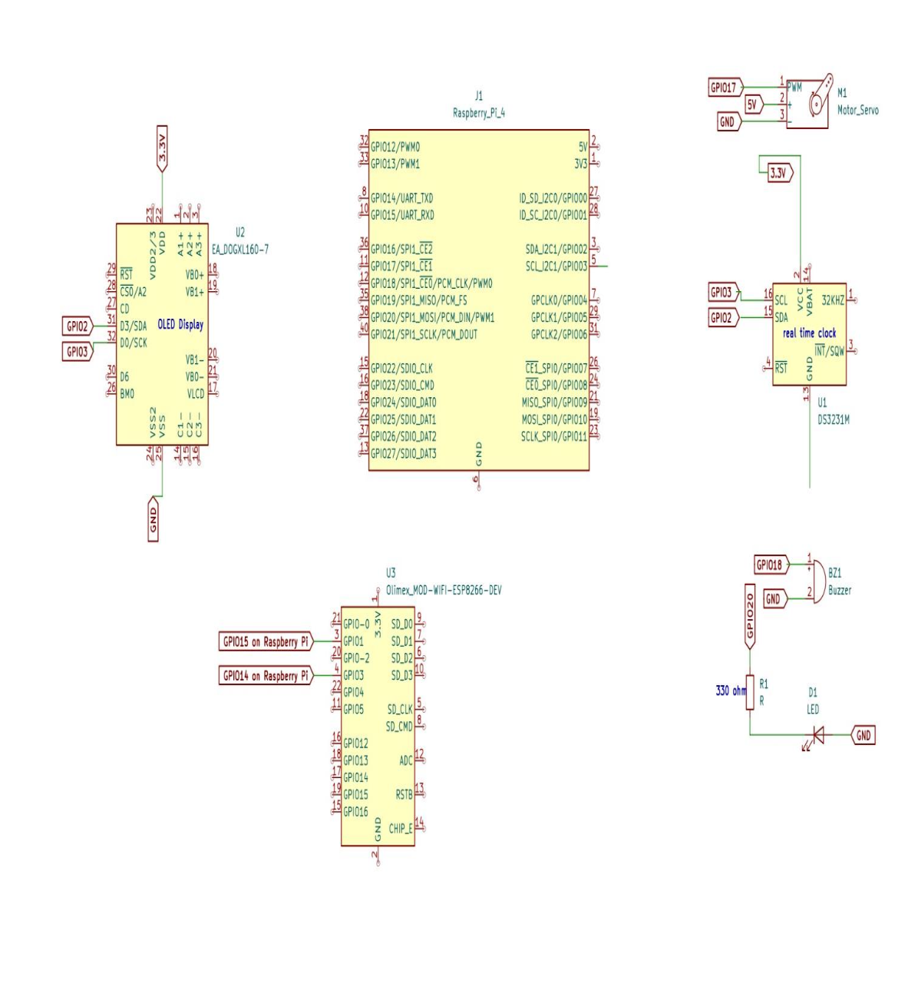
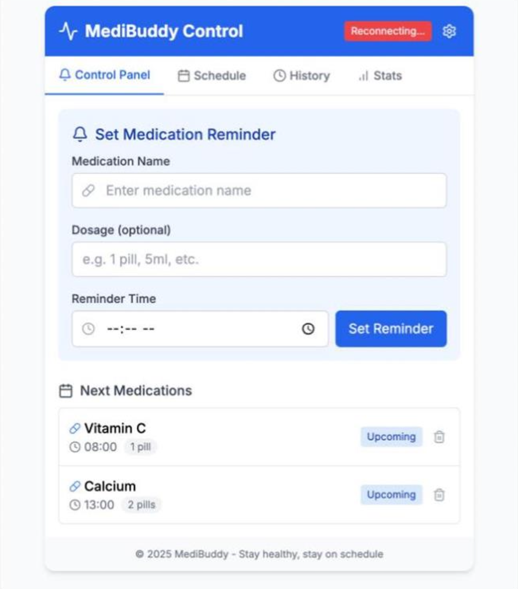
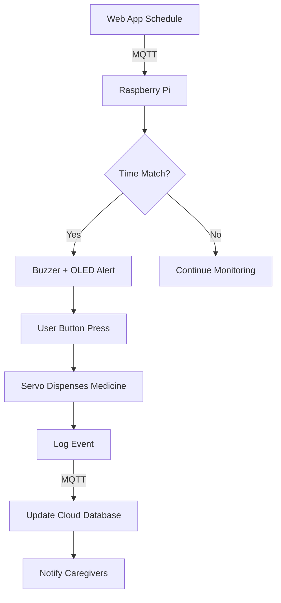

# 💊 Medibuddy - Smart Medical Dispenser and Reminder System

<div align="center">


*An IoT-based solution for automated medication management*

[](https://reactjs.org/)
[](https://nodejs.org/)
[](https://python.org/)
[](https://www.raspberrypi.org/)

</div>

## 📖 Overview

**Medibuddy** is an innovative IoT-based Smart Medical Dispenser and Reminder System designed to automate medication management for elderly and chronically ill patients. The system ensures timely medication intake through automated dispensing, real-time alerts, and cloud-based monitoring.


### 🎯 Key Features

- **Automated Dispensing**: Precise medication delivery using servo motor control
- **Real-time Alerts**: Visual (OLED) and auditory (buzzer) notifications
- **Cloud Integration**: MQTT-based communication for remote monitoring
- **User-friendly Interface**: React.js web application for caregivers
- **Accurate Timing**: RTC module ensures precise scheduling
- **Remote Monitoring**: Real-time medication adherence tracking

## 🏗️ System Architecture



### Hardware Components
- **Raspberry Pi 4**: Central controller and processing unit
- **DS3231 RTC Module**: Maintains accurate timekeeping
- **Servo Motor (SG90/MG995)**: Automated medicine dispensing
- **SSD1306 OLED Display**: Visual alerts and medicine information
- **Buzzer**: Audible reminder notifications
- **Push Button**: User confirmation of medication intake

### Software Stack
- **Frontend**: React.js with responsive design
- **Backend**: Node.js + Express.js
- **Database**: MongoDB for cloud storage
- **Communication**: MQTT protocol via HiveMQ Cloud
- **Hardware Control**: Python scripts on Raspberry Pi

## 🚀 Getting Started

### Prerequisites

- Node.js (v18.x or higher)
- Python 3.9+
- MongoDB instance
- Raspberry Pi 4 with Raspbian OS
- MQTT broker (HiveMQ Cloud recommended)

### Installation

#### 1. Clone the Repository
```bash
git clone https://github.com/atharvasakpal/SmartMedicineDispenser.git
cd SmartMedicineDispenser
```

#### 2. Backend Setup
```bash
cd Medibuddybackend
npm install
cp .env.example .env
# Configure your environment variables
npm start
```

#### 3. Frontend Setup
```bash
cd Medibuddyfrontend
npm install
npm start
```


### Environment Variables

Create a `.env` file in the backend directory:

```env
MONGODB_URI=your_mongodb_connection_string
MQTT_BROKER_URL=your_mqtt_broker_url
MQTT_USERNAME=your_mqtt_username
MQTT_PASSWORD=your_mqtt_password
```


## 🔧 Hardware Wiring


### Pin Connections (Raspberry Pi 4)

| Component | Raspberry Pi Pin | Description |
|-----------|------------------|-------------|
| RTC DS3231 | GPIO 2 (SDA), GPIO 3 (SCL) | I2C Communication |
| Servo Motor | GPIO 18 | PWM Control |
| OLED Display | GPIO 2 (SDA), GPIO 3 (SCL) | I2C Communication |
| Buzzer | GPIO 17 | Digital Output |
| Push Button | GPIO 27 | Digital Input (Pull-up) |
| Power | 5V, GND | Power Supply |

## 🎮 Usage

### Web Interface



1. **Schedule Medication**: Set up daily medication schedules
2. **Monitor Intake**: View real-time medication logs
3. **Manage Patients**: Add/edit patient information
4. **View Analytics**: Track medication adherence patterns

### Hardware Operation


1. System checks for scheduled medications using RTC
2. At scheduled time, buzzer sounds and OLED displays alert
3. User presses button to confirm they're ready
4. Servo motor dispenses the medication
5. System logs the event and updates cloud database

## 🔄 System Workflow




## 🚀 Future Enhancements

- [ ] **SMS & Email Alerts**: Notify caregivers via multiple channels
- [ ] **Mobile Application**: Native iOS/Android app with offline functionality
- [ ] **Multi-user Carousel**: Support for multiple patients/medications
- [ ] **AI Recommendations**: Machine learning for optimized dosing schedules
- [ ] **Physical Pickup Sensors**: Confirm medication is actually taken
- [ ] **Voice Commands**: Integration with voice assistants
- [ ] **Emergency Alerts**: Automated emergency notifications for missed critical medications


## 👥 Team

**Electronics Engineering Students - VJTI Mumbai**

- **Atharva Sakpal** (221060056) - Frontend & Backend Development
- **Shashwat Barai** (221060007) - Hardware Development & MQTT communication
- **Shivali Salunkhe** (221061057) - Frontend Development & UI/UX
- **Ramyaa Balasubramanian** (221061052) - System Architecture & Testing
- **Ishayu Potey** (221060049) - Hardware Design & Documentation

**Project Guide**: Dr. Rohin Daruwala  
**Institution**: Veermata Jijabai Technological Institute, Mumbai

## 🙏 Acknowledgments

- [Raspberry Pi Foundation](https://www.raspberrypi.org/) for excellent hardware documentation
- [HiveMQ](https://www.hivemq.com/) for reliable MQTT cloud services
- [MongoDB](https://www.mongodb.com/) for scalable database solutions
- Our project guide Dr. Rohin Daruwala for invaluable guidance
- VJTI Mumbai for providing the platform and resources


---

<div align="center">

**Made with ❤️ by VJTI Electronics Engineering Students**


*Empowering Healthcare Through Innovation*

</div>
